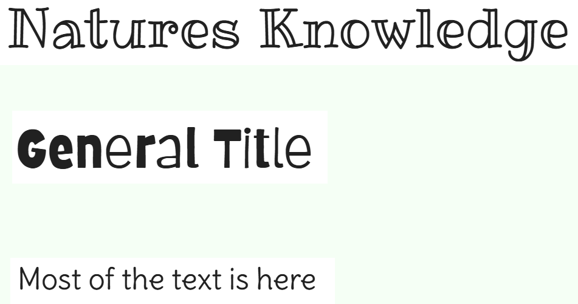

# Natures Knowledge 

Visit the deployed site: [Natures Knowledge](https://daviddock.github.io/natures-knowledge/)

## CONTENTS

* [User Experience](#user-experience)
  * [Who is the game for](#who-is-the-game-for)
  * [User Stories](#user-stories)

* [Design](#design)
  * [Colour Scheme](#colour-scheme)
  * [Typography](#typography)
  * [Images](#images)
  * [Wireframes](#wireframes)

* [Features](#features)
  * [Languages Used](#languages-used)
  * [Favicon](#favicon)
  * [Logo and Title](#logo-and-title)
  * [404 Page](#404-page)
  * [Accessibility](#accessibility)
  * [Future Implementations](#future-implementations)

* [Deployment](#deployment)
* [Testing](#testing)
* [Credits](#credits)

## User Experience

### Who is the game for

The game is primarily designed for children.
This means that the game has to entertain and be eye catching to grab the users attention.
Because the game is to be used by children it is important to ensure the user journey is clear and simple to follow.  

### User Stories

## 1. Heading and Logo Area
**As a** child user,  
**I want** to see a clear and engaging heading and logo area at the top of the quiz,  
**So that** I can easily recognize the quiz and understand its theme right away.

### Acceptance Criteria:
- The top of the quiz screen should include a heading (e.g., "Nature Quiz") that is large, bold, and easy to read.
- The heading should be visually appealing and appropriate for children, with a fun font and design.
- A logo related to the theme, nature, should be displayed near the heading.
- The logo should be clear, colorful, and fun, adding to the visual appeal of the quiz.
- The heading and logo should be responsive, adjusting to different screen sizes (desktop, tablet, and mobile).

## 2. Footer with Further Information
**As a** visitor,  
**I want** to see a footer with links to other developer projects by the same creator,  
**So that** I can explore more interactive projects or learn about other work they have done.

### Acceptance Criteria:
- The footer should be located at the bottom of the quiz page.
- The footer should include a link to the developers Github.
- The links should open in a new tab or window to avoid interrupting the quiz experience.
- The footer should be clean, unobtrusive, and not distract from the main quiz content.
- The footer should be responsive, adjusting its layout on different screen sizes (desktop, tablet, mobile).
  
---

## 3. Rules on Home Page
**As a** child user,  
**I want** to see a clear and simple explanation of the quiz rules on the home page,  
**So that** I understand how the quiz works and what to expect before I begin.

### Acceptance Criteria:
- The home page should include a brief section labeled "How to Play".
- The rules should be simple, short, and written in easy-to-understand language (age-appropriate).
- The rules should explain:
  - How many questions are in the quiz.
  - How many levels there are and what themed questions in each level.
  - How many lives you have.
  - The meaning of correct or incorrect answers (e.g., feedback and scoring).
- The "Quiz Rules" section should be clearly visible but not overpower the main "Start Quiz" button.
- The rules should be presented in a friendly, engaging manner.

---

## 4. Start Button on Home Screen
**As a** child user,  
**I want** to see a large, clear "Start Quiz" button,  
**So that** I can easily begin the quiz.

### Acceptance Criteria:
- The home screen should display a prominent "Start Quiz" button.
- The button should be colorful, large, and easy to click on both desktop and mobile devices.
- The button should be centered on the screen.
- When the button is clicked, the quiz starts and transitions to the first question.

---

## 5. Question Display
**As a** child user,  
**I want** to see one question at a time with multiple-choice answers,  
**So that** I can focus on answering each question individually.

### Acceptance Criteria:
- Only one question should be displayed at a time.
- The question should be in clear, large text, easy for children to read.
- The answer options should be provided, displayed as clickable buttons.
- The background of the home page should be relevent to the questions theme, e.g a picture of planets if the question is about space.

---

## 6. Simple and Fun Answers
**As a** child user,  
**I want** the answer choices to be colorful, engaging, and written in simple language,  
**So that** I can easily understand and enjoy the quiz.

### Acceptance Criteria:
- The answer options should be in simple, easy-to-read language (age-appropriate for the target age group).
- The buttons for answers should have a bright, colorful design.
- Each answer button should have some padding or space to ensure they are easy to click or tap.
- Hovering over an answer button should change its color to make it more interactive.

---

## 7. Immediate Feedback for Each Answer
**As a** child user,  
**I want** to see whether my answer is correct or incorrect immediately after selecting it,  
**So that** I can learn from my mistakes and celebrate correct answers.

### Acceptance Criteria:
- A message should appear that says whether the answer is correct or incorrect.
- This message should dissapear after 2 seconds and the next question should appear.

---

## 8. Progress Indicator
**As a** child user,  
**I want** to see how many questions I've answered,  
**So that** I know how much more is left to complete the quiz.

### Acceptance Criteria:
- A visible progress bar or counter should be displayed that shows the number of questions answered.
- The progress bar should update in real-time as the user answers each question.
- The counter should be positioned at the top or bottom of the screen for easy visibility.
- The progress indicator should reset when the quiz is restarted.

---

## 9. Lives Counter
**As a** child user,  
**I want** to see how many lives I have left,  
**So that** I know how close I am to loosing.

### Acceptance Criteria:
- A visible lives counter.
- The lives counter should update in real-time as the user answers each question, decreasing if the user answers incorrectly.
- The counter should be positioned at the top or bottom of the screen for easy visibility.
- The lives counter should reset when the quiz is restarted.

---

## 10. Level Indicator
**As a** child user,  
**I want** to see what level i'm on out of 4,  
**So that** I know how much more is left to complete the quiz.

### Acceptance Criteria:
- A visible level counter should be displayed.
- The level should update in real-time as the user answers each question.
- Each level displays the relevant questions and background image relating to the theme.
- The level should reset when the quiz is restarted.

## 11. Fun Results Screen
**As a** child user,  
**I want** to see a results screen at the end of the quiz that shows if I passed or failed the quiz.
**So that** I can know the result of the quiz.

### Acceptance Criteria:
- At the end of the quiz, a results screen should appear with either a congratulations or commiserations message.
- The results screen should be colorful, with an encouraging message.
- The screen should offer the option to "Play Again".

---

## 12. Play Again Option
**As a** child user,  
**I want** to be able to restart the quiz and play again if I want to improve my score,  
**So that** I can keep learning and have fun by taking the quiz multiple times.

### Acceptance Criteria:
- After viewing the results, the user should have the option to click a "Play Again" button to restart the quiz.
- The "Play Again" button should be visible and accessible without scrolling.
- If clicked, the quiz should restart, showing new questions or in a random order.

---

## 13. Randomized Question Order
**As a** child user,  
**I want** the questions to be randomized each time I take the quiz,  
**So that** I can enjoy different experiences each time I play.

### Acceptance Criteria:
- The order of questions should be different each time the user plays the quiz.
- The randomized order should contain 5 random questions from each nature theme (Animals, Sea, Space and Habitats) and should correspond to the level progression. This should keep the user interested and want to attempt the quiz again.
- There should be no repetition of questions within the same session.

---

## 14. Learn More About Nature
**As a** child user,  
**I want** to have access to information about nature,  
**So that** I can learn new and interesting information about nature..

### Acceptance Criteria:
- There should be an information page with sections on each subject quized about.
- The information page should be colorful and engaging with images of the relevant subjects to keep children entertained.
- The facts should be short, clear, and easy to understand for children.

---

## 15. 404 Page
**As a** user,  
**I want**  visit the site again if something went wrong,  
**So that** I can start the quiz again.

### Acceptance Criteria:
- If there is a 404 error a relevant page should appear to inform the user of whats happening.
- This page should have similar styling to the website to ensure best user experience.
- There should be a clear explanation of what happened and a large link to get back to the website to help the user navigate with ease.

---

## Design

### Colour Scheme

Because this game is designed to be enjoyable for children I opted to go for a really bright, colorful and cheerful color scheme whilst also matching the natural world ranging from outer space to the ocean. These colours where also represented in the images used.

To meet WCAG 2.0 criteria, the color scheme was then passed to [eightshapes.com](https://eightshapes.com/) to generate an accessibility table, I then only used accessible text colors to ensure easy reading.

### Typography

Again because this is a game with children in mind I used fun, playful fonts designed to entertain.

For the main heading and important text like the questions I used Ribeye Marrow, its a fun-filled font which is very stylised and ideal for headings and important text.

For the other headings I used Barriecito, its also a fun font which is stylish but easy to read.

For other parts of text, like the answer options I used Delius, again designed to be easy to read and more subtle. 

### Images

The images used where to enhance the user experience by linking to the theme of nature and also keeping in mind the target audience.

The main logo has nature cartoon images that tie into the quiz's question categories. This image animates upon refresh:

The main layout of the page consists of nature images in the background representing outer space at the top, the earth (or current question category) in the middle and the ocean at the bottom on the footer. This brings abit of visual fun for the user, especially the changing image in the main area when the quiz category changes.

### Wireframes

## Features  

### Languages Used  

HTML, CSS, JavaScript  

### Favicon

### Logo and Title  

### 404 Page  

### Accessibility

### Future Implementations  

## Deployment

Github Pages was used to deploy the website by the following steps:

* I went to Github.
* Selected my repository for this project.
* Clicked on the Settings link.
* Clicked on the Pages link in the left hand side navigation bar.
* In the Source section, I chose main from the drop down select branch menu and selected Root from the drop down select folder menu.
* Clicked save, and the live Github Pages site was deployed at [Natures Knowledge](https://daviddock.github.io/natures-knowledge/).  

To Fork the repository:  

* In Github go to the repository [https://github.com/DavidDock/natures-knowledge](https://github.com/DavidDock/natures-knowledge).
* Click the fork button in the top right corner.  

To Clone the repository:  

* In Github go to the repository [https://github.com/DavidDock/natures-knowledge](https://github.com/DavidDock/natures-knowledge).
*  Click the Code button and select if you'd like to clone with HTTPS, SSH or Github CLI and copy the link underneath.
* Open your terminal in your code editor and change the working directory to the location you want to use for the cloned directory.
* Type 'git clone', paste the link you copied and press enter.

## Testing

## Credits  

### Learning  

### New learning

## Content and Media  

